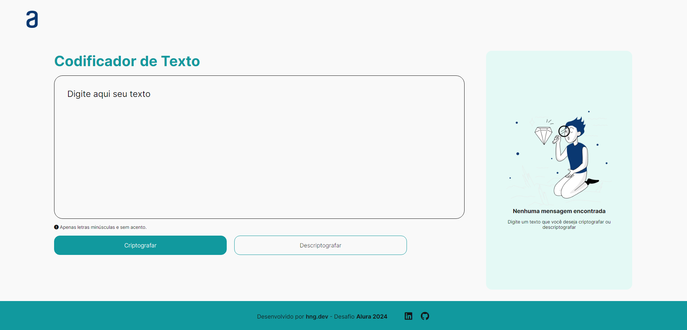

#challengeonedecodificador5

### Status do Projeto

# Codificador de texto
Projeto desenvolvido para o Desafio Iniciante em programação / T6-ONE Oracle Next Education em parceria com a Alura. 
O desafio consiste em construir um codificador/decodificador de texto usando JavaScript.

## O que foi utilizado 

  
  
  

## Lógica Utilizada no Código
O projeto utiliza uma abordagem simples de substituição de caracteres para codificar e decodificar texto. A lógica é implementada em JavaScript, e as substituições são feitas com base em um conjunto predefinido.

| Modelo para Criptografia | Modelo para Descriptografia |
|--------------------------|-----------------------------|
| a = ai                   | ai = a                      |
| e = enter                | enter = e                   |
| i = imes                 | imes = i                    |
| o = ober                 | ober = o                    |
| u = ufat                 | ufat = u                    |
    
## Demo
[Visualizar no GitHub Pages](https://heningdev.github.io/decodificador-de-texto/)

## Screenshot

